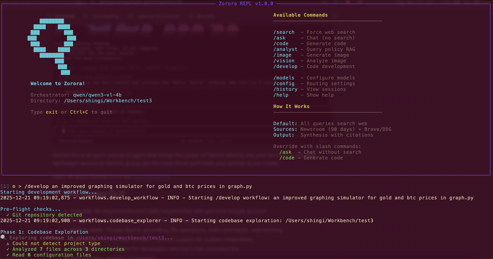
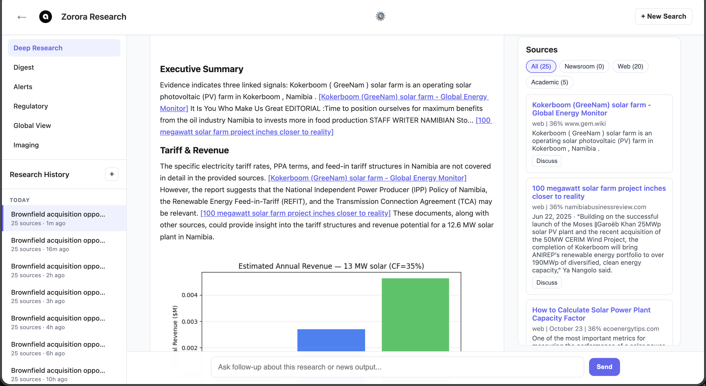

# Zorora

A local-deployment deep research engine that searches across academic databases, web sources, and newsroom articles, then synthesizes findings with credibility scoring and citation graphs. Built for macOS (Apple Silicon) with minimal RAM footprint, meant to be run directly from your computer, with all content, outputs, and chats stored locally and not in the cloud, giving you complete control and privacy.





## Core Value Proposition

Zorora transforms from a basic research tool into a **deep research engine** that:

1. **Searches EVERYTHING** - Academic databases (7 sources) + web search + Asoba newsroom
2. **Follows citation trails** - Multi-hop research that explores cited papers
3. **Cross-references claims** - Groups similar claims and counts agreement across sources
4. **Scores credibility** - Transparent rules-based scoring of source authority
5. **Builds citation graphs** - Visualizes relationships between sources
6. **Synthesizes with confidence** - Generates comprehensive answers with citation levels

## Quick Start

### Prerequisites

- **Python 3.8+**
- **LM Studio** running on `http://localhost:1234`
  - Download: [lmstudio.ai](https://lmstudio.ai)
  - Load a 4B model (e.g., Qwen3-VL-4B, Qwen3-4B)
- **HuggingFace token** (optional) - For remote Codestral endpoint
- **Brave Search API key** (optional) - For enhanced web search

### Installation

```bash
pip install git+https://github.com/AsobaCloud/zorora.git
```

### Run

**Terminal Interface (for engineers):**
```bash
zorora
```

**Web Interface (for non-engineers):**
```bash
zorora web
# Opens at http://localhost:5000
```

## Features

### Deep Research Capabilities

- **6-Phase Research Pipeline:**
  1. **Parallel Source Aggregation** - Searches academic (7 sources), web (Brave + DDG), and newsroom simultaneously
  2. **Citation Following** - Multi-hop exploration of cited papers (configurable depth: 1-3)
  3. **Cross-Referencing** - Groups claims by similarity and counts agreement
  4. **Credibility Scoring** - Rules-based scoring of source authority (academic journals, predatory publishers, retractions)
  5. **Citation Graph Building** - Constructs directed graphs showing source relationships
  6. **Synthesis** - Generates comprehensive answers with confidence levels and citations

- **Research Depth Levels:**
  - **Quick** - Initial sources only (skips citation following)
  - **Balanced** - Adds citation following (1 hop)
  - **Thorough** - Multi-hop citation exploration (up to 3 levels deep)

- **Local-First Architecture:**
  - All processing and storage on your machine
  - SQLite database for fast indexed queries (`~/.zorora/zorora.db`)
  - JSON files for full research findings (`~/.zorora/research/findings/`)
  - Zero cloud dependencies (except source fetching)
  - Complete privacy - research data never leaves your machine

### Additional Features

- **Research persistence** - Save/load findings with metadata
- **Code generation** - Dedicated Codestral model for coding tasks
- **Multi-step development** - `/develop` workflow: explore → plan → approve → execute → lint
- **Slash commands** - Force workflows: `/search`, `/ask`, `/code`, `/develop`, `/image`, `/vision`
- **Deterministic routing** - Pattern-based decision tree (no LLM routing failures)
- **Hybrid deployment** - Local 4B orchestrator + remote 32B specialists
- **RAM-efficient** - Runs on MacBook Air M3 with 4B model
- **Dual interfaces** - Terminal REPL for engineers, Web UI for non-engineers

## Basic Usage

### Deep Research Query

**Terminal:**
```
[1] ⚙ > What are the latest developments in large language model architectures?
```

**Web UI:**
- Enter research question
- Select depth level (Quick/Balanced/Thorough)
- Click "Start Research"

Zorora automatically:
- Aggregates sources from academic databases, web, and newsroom (parallel)
- Follows citation trails (if depth > 1)
- Cross-references claims across sources
- Scores credibility of each source
- Builds citation graph
- Synthesizes findings with citations and confidence levels

### Code Generation

```
[2] ⚙ > Write a Python function to validate email addresses
```

Routes to Codestral specialist model for code generation.

### Save Research

```
[3] ⚙ > Save this as "llm_architectures_2024"
Saved to: ~/.zorora/research/llm_architectures_2024.md
```

### Load Research

```
[4] ⚙ > Load my research on LLM architectures
```

## Slash Commands

### Workflow Commands

- **`/search <query>`** - Force deep research workflow (academic + web + newsroom + synthesis)
- **`/ask <query>`** - Force conversational mode (no web search)
- **`/code <prompt>`** - Force code generation with Codestral
- **`/develop <request>`** - Multi-step code development workflow
- **`/image <prompt>`** - Generate image with FLUX
- **`/vision <path> [task]`** - Analyze image with vision model

### System Commands

- **`/models`** - Interactive model selector
- **`/config`** - Show current routing configuration
- **`/history`** - Browse saved conversation sessions
- **`/help`** - Show available commands
- **`exit`, `quit`, `q`** - Exit the REPL

For detailed command reference, see [COMMANDS.md](COMMANDS.md).

## Configuration

### Quick Setup

Use the interactive `/models` command:

```
[1] ⚙ > /models
```

### Manual Configuration

1. Copy `config.example.py` to `config.py`
2. Edit `config.py` with your settings:
   - LM Studio model name
   - HuggingFace token (optional)
   - Brave Search API key (optional)
   - Specialist model configurations

### Web Search Setup

**Brave Search API** (recommended):
- Get free API key at: https://brave.com/search/api/
- Free tier: 2000 queries/month (~66/day)
- Configure in `config.py`:
  ```python
  BRAVE_SEARCH = {
      "api_key": "YOUR_API_KEY",
      "enabled": True,
  }
  ```

**DuckDuckGo Fallback:**
- Automatically used if Brave Search unavailable
- No API key required

## Architecture

Zorora uses **deterministic routing** with pattern matching (no LLM-based orchestration):

```
User Query / Slash Command
    ↓
Pattern Matching (simplified_router.py)
    ↓
    ├─→ DEEP RESEARCH WORKFLOW (6-phase pipeline)
    │   ├─► Parallel Source Aggregation
    │   ├─► Citation Following (multi-hop)
    │   ├─► Cross-Referencing
    │   ├─► Credibility Scoring
    │   ├─► Citation Graph Building
    │   └─► Synthesis
    ├─→ CODE WORKFLOW (Codestral specialist)
    ├─→ DEVELOPMENT WORKFLOW (/develop - multi-step)
    ├─→ FILE OPERATIONS (save/load/list)
    └─→ SIMPLE Q&A (/ask - direct model)
```

**Key Principles:**
- **Local-first** - Everything runs on your machine
- **Deterministic workflows** - Code-controlled pipelines, not LLM orchestration
- **Pattern matching** - Ensures consistent routing (0ms decision time)
- **Specialist models** - Dedicated models for specific tasks
- **Dual interfaces** - Terminal for engineers, Web UI for non-engineers

For detailed architecture documentation, see [docs/ARCHITECTURE.md](docs/ARCHITECTURE.md).

## Module Structure

```
zorora/
├── main.py                      # Entry point
├── repl.py                      # REPL loop and slash commands
├── config.py                    # Configuration
├── simplified_router.py          # Deterministic routing
├── research_workflow.py         # Research pipeline
├── turn_processor.py            # Workflow orchestration
├── tool_executor.py             # Tool execution
├── tool_registry.py             # Tool definitions
├── ui/web/                      # Web UI (Flask app)
│   ├── app.py
│   ├── templates/
│   │   └── index.html
│   └── static/
│       └── images/
└── workflows/                   # Multi-step workflows
    ├── develop_workflow.py
    ├── codebase_explorer.py
    ├── code_planner.py
    └── code_executor.py
```

## Documentation

- **[COMMANDS.md](COMMANDS.md)** - Complete command reference
- **[docs/ARCHITECTURE.md](docs/ARCHITECTURE.md)** - Detailed architecture explanation
- **[docs/DEEP_RESEARCH_IMPLEMENTATION.md](docs/DEEP_RESEARCH_IMPLEMENTATION.md)** - Deep research feature roadmap
- **[docs/WORKFLOWS.md](docs/WORKFLOWS.md)** - Workflow documentation
- **[docs/TROUBLESHOOTING.md](docs/TROUBLESHOOTING.md)** - Troubleshooting guide
- **[docs/BEST_PRACTICES.md](docs/BEST_PRACTICES.md)** - Best practices
- **[docs/DEVELOPMENT.md](docs/DEVELOPMENT.md)** - Development workflow details

## Performance

- **Routing decision:** 0ms (pattern matching)
- **Research workflow:** Varies by depth
  - Quick (depth=1): Initial sources only
  - Balanced (depth=2): + Citation following
  - Thorough (depth=3): + Multi-hop citations
- **Code generation:** 10-90 seconds (local: 10-30s, HF 32B: 60-90s)
- **RAM usage:** 4-6 GB (4B orchestrator model)

## Why This Architecture?

**Problem:** 4B models struggle with LLM-based orchestration (JSON generation, tool chaining, loop detection).

**Solution:** Code handles complexity:
- Pattern matching routes queries (no LLM decision)
- Hardcoded 6-phase research pipeline (no LLM planning)
- Deterministic error handling (no LLM recovery)
- Local-first storage (SQLite + JSON files)

**Result:** 100% reliability with 4B models, 1/3 the RAM usage of 8B orchestrators, complete privacy with local storage.

For more details, see [docs/ARCHITECTURE.md](docs/ARCHITECTURE.md) and [docs/DEEP_RESEARCH_IMPLEMENTATION.md](docs/DEEP_RESEARCH_IMPLEMENTATION.md).

## Troubleshooting

### LM Studio Not Connected
**Solution:** Start LM Studio and load a model on port 1234

### Research Workflow Not Triggered
**Solution:** Include research keywords: "What", "Why", "How", "Tell me", or use `/search` command

### Can't Save Research
**Solution:** Check `~/.zorora/research/` directory exists and is writable

### HuggingFace Endpoint Errors
**Solution:** Check HF endpoint URL, verify token, ensure endpoint is running

### Web UI Not Starting
**Solution:** Ensure Flask is installed: `pip install flask`, then run `zorora web`

For detailed troubleshooting, see [docs/TROUBLESHOOTING.md](docs/TROUBLESHOOTING.md).

## License

See LICENSE file.

---

**Repository:** https://github.com/AsobaCloud/zorora  
**EnergyAnalyst:** https://huggingface.co/asoba/EnergyAnalyst-v0.1  
**Version:** 1.0.0
