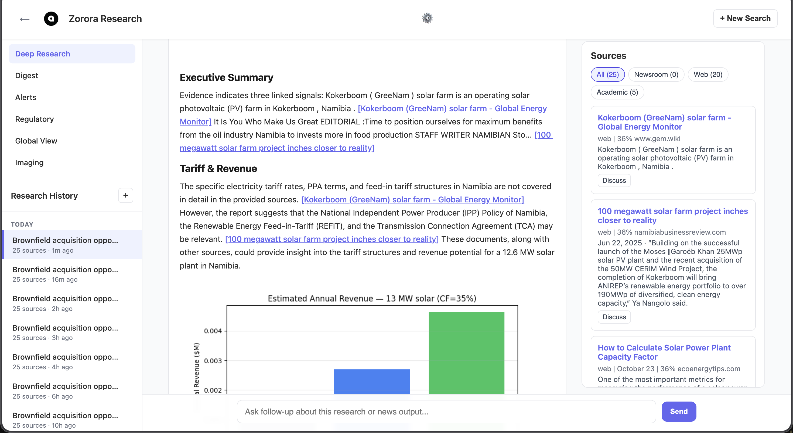

# Zorora


Zorora is a local-first deep research and analysis tool for policy, market, and technical intelligence. It runs against local LLM endpoints, supports both terminal and web interfaces, and handles everything from source discovery to structured data analysis.

**Learn more in the [full documentation](https://code.asoba.co)**.



## Features

- **Deep research** — multi-source aggregation (academic, web, newsroom) with multi-stage synthesis (outline → per-section expansion), relevance scoring with stemming, cross-reference detection, and freshness signals
- **Comparative queries** — auto-detects "X vs Y" queries and generates dimension-based comparison tables
- **Source quality** — credibility scoring, cross-reference detection, and full article content extraction for grounded analysis
- **Data analysis** — sandboxed Python execution with pandas, numpy, and matplotlib for structured dataset workflows
- **Multi-provider LLM** — local models via LM Studio, plus HuggingFace, OpenAI, and Anthropic adapters
- **Dual interfaces** — terminal REPL with Rich UI and web UI with two-column research layout and persistent history sidebar
- **Follow-up chat** — conversational follow-ups grounded in source content snippets

## Configuration

Research depth profiles, model budgets, and synthesis settings are configured in `config.py`. See the [full documentation](https://code.asoba.co) for details.

## Get Started

For detailed setup instructions, see the [setup documentation](https://code.asoba.co).

1. Install Zorora:

    ```bash
    pip install git+https://github.com/AsobaCloud/zorora.git
    ```

    Or from source:

    ```bash
    git clone https://github.com/AsobaCloud/zorora.git
    cd zorora
    pip install -e .
    ```

2. Run Zorora:

    ```bash
    zorora
    ```

    Or launch the web UI:

    ```bash
    zorora web
    ```

## Reporting Issues

File a [GitHub issue](https://github.com/AsobaCloud/zorora/issues) to report bugs or request features.

## License

Apache 2.0 — see [LICENSE.md](LICENSE.md).
